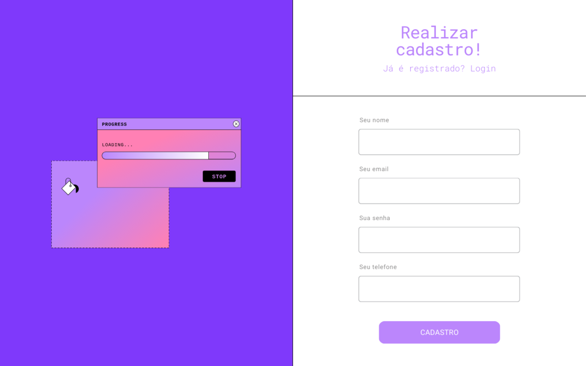
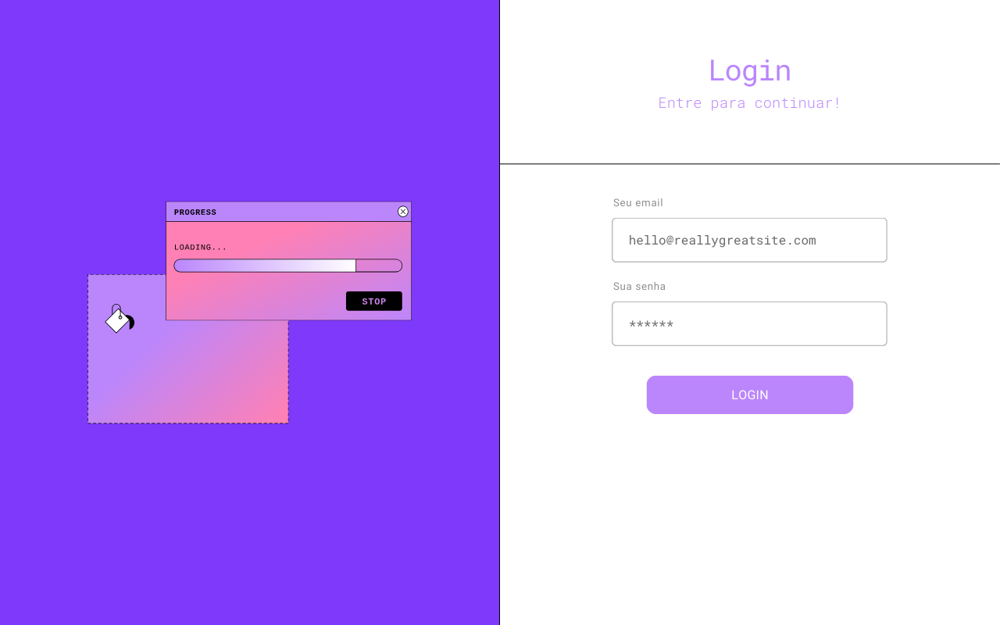
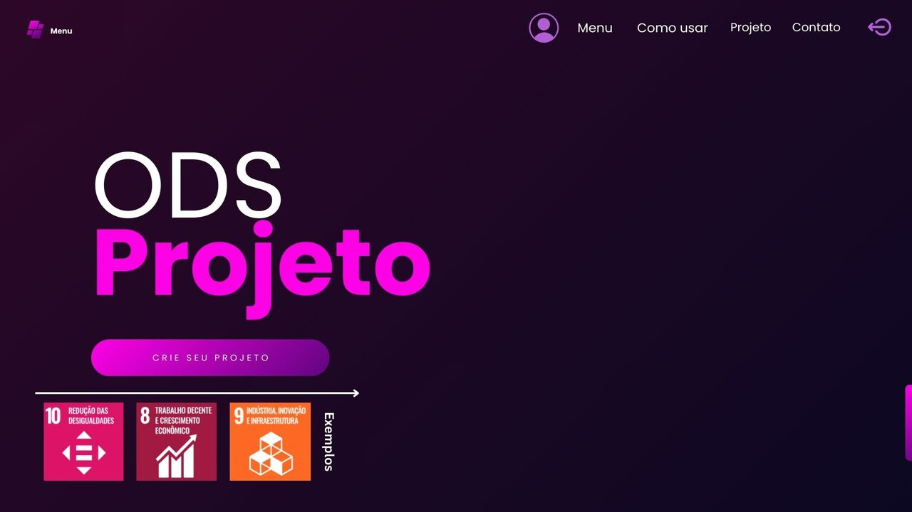
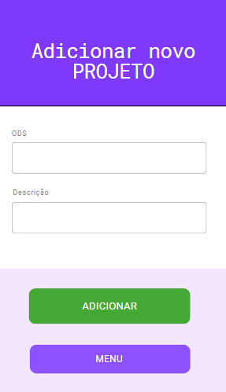

# Aplicativo de Projeto ODS

Este é um simples aplicativo de Registro e Login e Cadastro de Projeto desenvolvido em Java e MySQL por Andrew Souza (@nszandrew).

## Descrição

O Aplicativo de Projeto ODS permite aos usuários registrarem-se, fazerem login e cadastrarem projetos relacionados aos Objetivos de Desenvolvimento Sustentável (ODS).

## Funcionalidades

- Registro de usuário
- Login de usuário
- Cadastro de projetos ODS

## Tecnologias Utilizadas

- **Linguagem de Programação**: Java
- **Banco de Dados**: MySQL
- **Design**: Java Swing e ferramentas do NetBeans

## Instalação

1. **Clone o repositório**:

    ```bash
    git clone https://github.com/nszandrew/AplicativoProjeto.git
    ```

2. **Configuração do Banco de Dados**:

    - Certifique-se de ter o MySQL instalado em sua máquina.
    - Crie um banco de dados no MySQL para o projeto.
    - O arquivo com o banco de dados configurado esta no projeto com o nome de (SQLScriptProjetoFinal (1).sql).

3. **Compilação e Execução**:

    - Abra o projeto em sua IDE.
    - Compile e execute a aplicação a partir da IDE.

## Como Usar

1. **Inicie o Programa**:

    - Após configurar o banco de dados e iniciar a aplicação, acesse a pagina de registro.

2. **Registro**:

    - Faça seu registro fornecendo as informações validas.
     

3. **Login**:

    - Faça login usando as mesmas informações validas de registro.
      

4. **Cadastro de Projetos ODS**:

    - Após logar, cadastre novos projetos relacionados a ODS.
  
       

## Contribuição

Este é um projeto acadêmico e não é destinado a desenvolvimento profissional. No entanto, sugestões e melhorias são bem-vindas.
Email - (nszandrew10@gmail.com)

## Autor

Este projeto foi desenvolvido por Andrew Souza (@nszandrew) para um projeto da faculdade. 

##Contato

Conecte-se comigo no meu Linkedin: https://www.linkedin.com/posts/nszandrew_java-mysql-jdbc-activity-7207571419927425024-sowI?utm_source=share&utm_medium=member_desktop

## Licença

Este projeto está licenciado sob a [Licença MIT](LICENSE).
